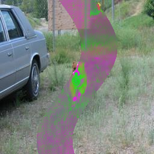
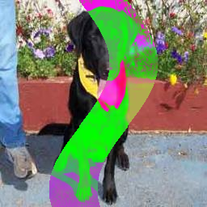

# Evaluación Práctica - Visión por Computador

## Variante D: Recorte Dinámico por Franja

**Estudiante:** Estudiante 19

---

### 1. Instrucciones

**Objetivo:** Aplicar técnicas de visión artificial para resolver el siguiente problema visual.

**Pasos:**

1. Determine los límites de la franja ondulada.
2. Descarte todo a la izquierda de la franja. Quédese con la parte derecha intacta.

---

### 2. Guía Visual y Material de Trabajo

La siguiente tabla contiene:

* **Columnas 1 y 2:** Un ejemplo resuelto para que entienda la lógica (observe cómo se transforma el "Ejemplo" en la "Solución").
* **Columna 3:** **SU EXAMEN**. Esta es la imagen que debe descargar y procesar mediante código.

| 1. Ejemplo (Entrada) | 2. Ejemplo (Solución) | 3. SU EXAMEN (Imagen de Trabajo) |
|:---:|:---:|:---:|
|  |  |  |
| *Referencia del problema* | *Resultado esperado del ejemplo* | **¡Trabaje sobre esta imagen!** |

> **Nota:** Aunque la lógica visual es idéntica a la del ejemplo, los parámetros numéricos exactos (posiciones, frecuencias, colores) de su examen (Columna 3) son aleatorios y propios de su imagen. Debe calcularlos dinámicamente.

---

### 3. Criterios de Evaluación

Es importante tomar en cuenta lo siguiente para resolver el ejercicio:

* No se requiere ningún método especial para resolver el ejercicio, únicamente lo visto en las **UNIDADES 1 y 2**.
* Se valorará la solución planteada considerando lo siguiente:
  * Se usan métodos simples de recorrido de pixeles de la imagen del ejercicio.
  * El código es funcional y obtiene el resultado requerido.
  * La solución propuesta está correctamente explicada en función de lo visto en clase.
  * Se incluye una descripción matemática del algoritmo desarrollado.
* Debe subir el código y la imagen resultante que ha obtenido en el AVAC y una explicación clara de cómo planteó su solución para la prueba.

**El tiempo será un factor considerado para la evaluación, ya que al sobrepasar las 2 horas existirá penalización. Asimismo, se valorará si el código es generado por el estudiante.**
